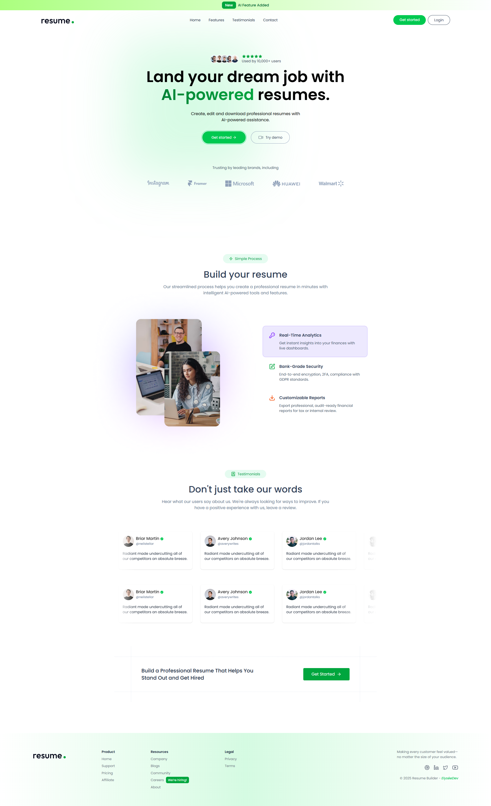
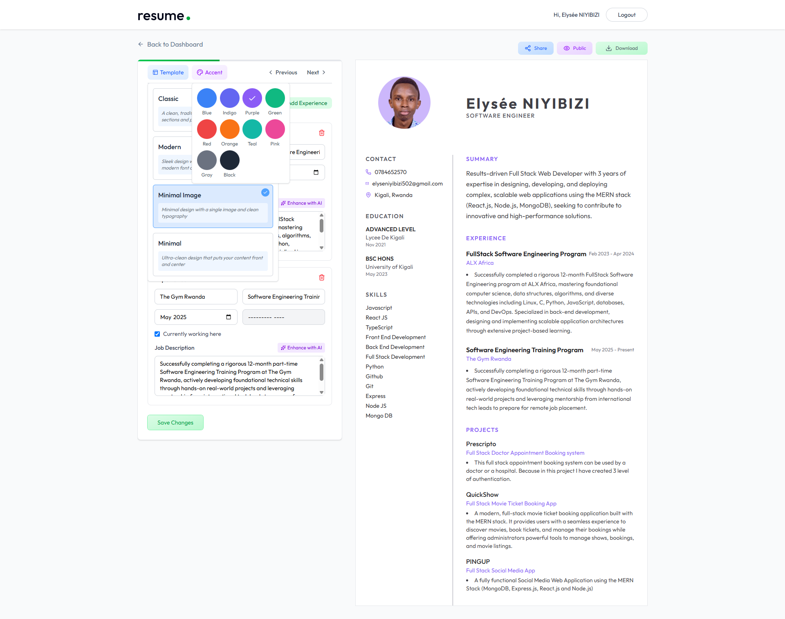

<div align="center">

# RESUME BUILDER PRO

AI-Powered Professional Resume Builder with Real-time Optimization


Built with modern technologies and AI integration


## Live Demo

Add your deployed Vercel link here

| User Interface | Dashboard |
|---------------|-----------|
|  |  |

</div>

---

## Project Overview

Resume Builder Pro is a full-stack MERN web application designed to help users create professional resumes easily using AI-powered tools.

Features include:

- Professional resume templates
- AI-powered resume optimization
- Real-time resume preview
- Resume sharing links
- Profile photo upload
- CV upload and PDF parsing
- Cloud image storage
- Resume management dashboard

---

## Key Features

### User Authentication

- Secure Sign Up/Login
- JWT Authentication
- User Dashboard
- Session Persistence

### Resume Creation

- Personal Information
- Education
- Experience
- Skills
- Projects
- Professional Summary

### Resume Templates

- Modern Template
- Classic Template
- Minimal Template
- Minimal Image Template

### AI Features

- Resume Content Optimization
- Skill Suggestions
- ATS Improvement
- Grammar Enhancement

### File Upload

- Upload existing CV
- Extract PDF text
- Upload profile image
- Image optimization using ImageKit

---

## Tech Stack

### Frontend

- React 19
- Redux Toolkit
- React Router DOM
- Tailwind CSS
- Axios
- React Hot Toast
- React PDF-to-text

### Backend

- Node.js
- Express.js
- MongoDB
- Mongoose
- JWT
- bcrypt
- Multer
- CORS

### AI and Cloud Services

- OpenAI API
- ImageKit

---

## Project Structure

```bash
resumebuilder/
├── client/
├── server/
└── README.md
